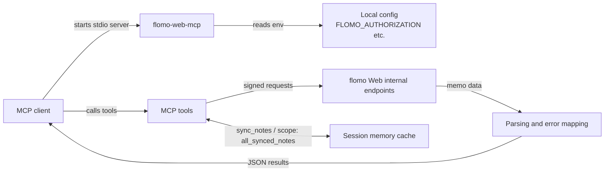

# flomo-web-mcp

[中文](README.md) | English

Let Claude and other [Model Context Protocol](https://modelcontextprotocol.io) clients read and write your flomo memos: list, search, get, count tags, randomly roam, and create memos. It is a local stdio MCP server that uses your own flomo Web session.

<!-- shared: kept identical in flomo-web-cli and flomo-web-mcp; update both -->

> This is not an official flomo project. It relies on flomo Web internal endpoints and your own session credentials, which may change at any time. Run it only in local environments you trust.

<!-- /shared -->

## Quick Start

1. Get your `Authorization` value as described in [Getting Authorization](#getting-authorization).
2. Add this to your MCP client configuration (no separate install needed; `npx` downloads and runs it):

   ```json
   {
     "mcpServers": {
       "flomo": {
         "command": "npx",
         "args": ["-y", "flomo-web-mcp"],
         "env": {
           "FLOMO_AUTHORIZATION": "Bearer your-token-here"
         }
       }
     }
   }
   ```

   With Claude Code, you can run this instead:

   ```bash
   claude mcp add flomo -e FLOMO_AUTHORIZATION="Bearer your-token-here" -- npx -y flomo-web-mcp
   ```

3. Restart the client and just ask, e.g. "Show me my recent flomo notes" or "Pick a random memo tagged #reading".

## Features

- List recent memos, get a memo by `slug`, search by keyword, count tags, randomly roam, and create memos.
- `sync_notes` syncs every memo into an in-memory cache for the current session, enabling full-archive search, lookup, and random selection; later syncs fetch only what changed.
- Keeps memo line breaks and list structure, and supports image-only and attachment-only memos.
- Read-only tools carry the `readOnlyHint` annotation and `create_note` is marked as a write, so clients can decide when to ask for confirmation.

## MCP Tools

| Tool | Description |
| --- | --- |
| `list_notes` | List recent memos, newest first. |
| `search_notes` | Search recent memos by keyword; pass `scope: "all_synced_notes"` to search the sync cache. |
| `get_note` | Get one memo by `slug`; supports `scope`, and `includeHtml: true` also returns the raw rich-text HTML. |
| `list_tags` | List tags with memo counts, most used first; supports `scope`. |
| `sync_notes` | Sync memos into the in-memory cache and return only sync statistics; with an existing cache it fetches only changes since the last sync, and `full: true` forces a full rebuild. |
| `random_note` | Return one random memo from the sync cache, syncing first if the cache is missing or older than 10 minutes. Supports `tags`, `excludeTags`, and `refresh`, and falls back to the session cache if a refresh fails. |
| `create_note` | Create a memo, optionally with `tags`. |
| `ping` | Check that the server is reachable. |

Tools return compact JSON. To save context, memos include only `content`, which keeps line breaks and list structure, and omit the raw `html` by default.

### Recent memos and full sync

By default, `list_notes`, `search_notes`, `get_note`, and `list_tags` only see the recent batch of memos returned by flomo Web. To cover every memo, call `sync_notes` to build the cache, then pass this to those tools:

```json
{
  "scope": "all_synced_notes"
}
```

The first sync fetches every memo. Later `sync_notes` calls, including `random_note`'s automatic refresh, fetch only memos created, edited, or deleted since the last sync and merge them into the cache. The result's `mode` is `full` or `incremental`; `synced` counts memos added or updated by this run, `removed` counts deleted memos removed from the cache, and `totalCached` is the cache size.

`sync_notes` accepts `pageSize` (max 200) and `maxPages` (max 100). If the page limit is reached, `complete` is `false` and the next call resumes where it stopped. If the cache looks wrong, pass `full: true` to discard it and sync again.

`random_note` accepts `tags` as an allowlist and `excludeTags` as a blocklist; a parent tag matches its hierarchical child tags, and the blocklist wins. `refresh: true` forces a sync and `refresh: false` always uses the existing cache:

```json
{
  "tags": ["work", "idea"],
  "excludeTags": ["private"],
  "refresh": false
}
```

The Session Sync Cache lives only in the memory of the current server process, so it must be synced again after the client restarts. It is not persistent storage, a backup, or an authoritative data source.

## Requirements

<!-- shared: kept identical in flomo-web-cli and flomo-web-mcp; update both -->

- Node.js 20.19.0 or newer (ships with npm / npx). Node.js 20 reached end-of-life in April 2026, and **0.3.0 will require Node.js 22.12 or newer**; running on Node.js 20 prints an upgrade notice.
- Your own flomo Web session `Authorization` value; see [Getting Authorization](#getting-authorization). flomo Pro is not required.

<!-- /shared -->

## Install

### Run with npx (recommended)

This is the [Quick Start](#quick-start) configuration. Nothing to install; `npx` uses the latest version on npm.

### Install globally with npm

```bash
npm install -g flomo-web-mcp
```

Then set `command` to `flomo-web-mcp` and drop `args` in the client configuration:

```json
{
  "mcpServers": {
    "flomo": {
      "command": "flomo-web-mcp",
      "env": {
        "FLOMO_AUTHORIZATION": "Bearer your-token-here"
      }
    }
  }
}
```

### Run from source

```bash
git clone https://github.com/godisabug/flomo-web-mcp.git
cd flomo-web-mcp
npm install
npm run build
```

In the client configuration, use `"command": "node"` with the absolute path of the build output in `args`, e.g. `["D:/Projects/flomo-web-mcp/dist/index.js"]`. Run `npm run verify` for the full local verification chain.

## Configure

Pass credentials and other settings through the `env` block of your MCP client configuration. The server also reads a `.env` file from its working directory (see [.env.example](.env.example)).

<!-- shared: kept identical in flomo-web-cli and flomo-web-mcp; update both -->

| Variable | Default | Description |
| --- | --- | --- |
| `FLOMO_AUTHORIZATION` | none | **Required.** The `Authorization` value from flomo Web requests, e.g. `Bearer ...`. |
| `FLOMO_COOKIE` | none | flomo Web cookie; only needed if the endpoints require it. |
| `FLOMO_TIMEZONE` | `Asia/Shanghai` | IANA timezone used to interpret flomo timestamps and to date new memos. |
| `FLOMO_REQUEST_TIMEOUT_MS` | `30000` | Per-request timeout in milliseconds. |
| `FLOMO_USER_AGENT` | `Mozilla/5.0` | User-Agent sent with requests. |
| `FLOMO_BASE_URL` | `https://flomoapp.com` | flomo API base URL. |
| `FLOMO_WEB_BASE_URL` | `https://v.flomoapp.com` | flomo Web base URL, used for request headers and memo links. |
| `LOG_LEVEL` | `info` | `debug`, `info`, `warn`, or `error`. |
| `FLOMO_DEVICE_ID` | random per start | Advanced: device ID request header. |
| `FLOMO_DEVICE_MODEL` | `Other` | Advanced: device model request header. |
| `FLOMO_WEB_PLATFORM` | `Web` | Advanced: platform request header. |
| `FLOMO_READ_ENDPOINT` | built-in path | Advanced: override if flomo's internal read endpoint changes. |
| `FLOMO_SYNC_ENDPOINT` | built-in path | Advanced: override if flomo's internal sync endpoint changes. |
| `FLOMO_WRITE_ENDPOINT` | built-in path | Advanced: override if flomo's internal write endpoint changes. |

<!-- /shared -->

## How It Works



## Getting Authorization

<!-- shared: kept identical in flomo-web-cli and flomo-web-mcp; update both -->

Using Microsoft Edge or Chrome:

1. Log in to [flomo Web](https://v.flomoapp.com), press `F12` (`Cmd` + `Option` + `I` on macOS) to open DevTools, and switch to the `Network` panel.
2. Refresh the page, filter requests by `api/v1/memo/updated`, and open any matching request.
3. Under `Headers` → `Request Headers`, copy the full `Authorization` value starting with `Bearer `.


> Copy only the `Bearer ...` value, without the `Authorization:` field name. It is equivalent to your login session: never commit it, paste it into issues, or share screenshots of it. An `AUTH_EXPIRED` error means the session has expired; repeat the steps above to get a new value.

<!-- /shared -->

Then put it in `env.FLOMO_AUTHORIZATION` of your MCP client configuration.

## Security Notes

<!-- shared: kept identical in flomo-web-cli and flomo-web-mcp; update both -->

- Never commit or share `.env`, `FLOMO_AUTHORIZATION`, `FLOMO_COOKIE`, or any file, log, or raw flomo response containing memo content.
- Do not paste credentials into public issues, online debugging tools, or untrusted third-party services.
- flomo Web internal endpoints can change at any time. If reads or writes suddenly fail, you can temporarily override the paths with `FLOMO_READ_ENDPOINT`, `FLOMO_SYNC_ENDPOINT`, or `FLOMO_WRITE_ENDPOINT`, and please open an issue.

<!-- /shared -->

- The server redacts common `authorization`, `cookie`, and `token` fields in log metadata, but that does not replace protecting your credentials and logs yourself.

## Risk Notice

<!-- shared: kept identical in flomo-web-cli and flomo-web-mcp; update both -->

By using this project, you understand and accept the following risks:

- This project is maintained by community developers. It does not represent flomo and has no endorsement or service commitment from flomo.
- It is provided "as is", with no guarantee of availability, endpoint stability, data integrity, or fitness for every use case.
- You are responsible for ensuring your usage complies with flomo's terms of service, applicable laws, and your organization's security requirements.
- You bear the risks of account issues, credential leaks, data loss, failed requests, service interruptions, or third-party restrictions arising from its use.
- To the maximum extent permitted by applicable law, the developers and contributors are not liable for any direct or indirect loss arising from these risks.

<!-- /shared -->

## Related Projects

<!-- shared: kept identical in flomo-web-cli and flomo-web-mcp; update both -->

| Project | Form | Best for |
| --- | --- | --- |
| [flomo-web-cli](https://github.com/godisabug/flomo-web-cli) | Command-line tool `flomo-web` | Working with memos from a terminal or scripts |
| [flomo-web-mcp](https://github.com/godisabug/flomo-web-mcp) | MCP stdio server | Letting Claude and other MCP clients read and write memos |

Both share the same flomo access logic (request signing, memo parsing, time handling, and error handling), and behave the same way; when that shared logic changes, both are released together under the same version number.

<!-- /shared -->

## License

<!-- shared: kept identical in flomo-web-cli and flomo-web-mcp; update both -->

MIT, see [LICENSE](LICENSE).

<!-- /shared -->
