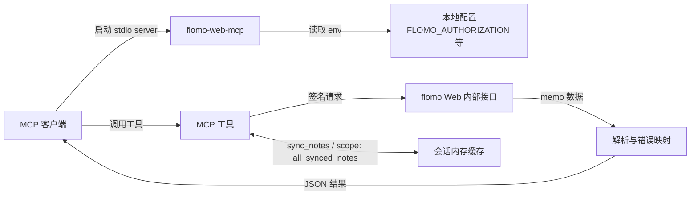

# flomo-web-mcp

中文 | [English](README.en.md)

让 Claude 等支持 [Model Context Protocol](https://modelcontextprotocol.io) 的 AI 客户端读写你的 flomo memo：列出、搜索、查看、统计标签、随机漫游和新建。它是一个在本地运行的 stdio MCP server，使用你自己的 flomo Web 登录态。

<!-- shared: 与 flomo-web-cli / flomo-web-mcp 共用，修改时两个仓库同步 -->

> 本项目不是 flomo 官方项目。它依赖 flomo Web 的内部接口和你自己的会话凭据，接口可能随时变化；请只在你信任的本地环境中运行。

<!-- /shared -->

## 快速开始

1. 按[获取 Authorization](#获取-authorization)拿到你的 `Authorization`。
2. 在 MCP 客户端的配置中加入下面的内容（无需预先安装，`npx` 会自动下载并运行）：

   ```json
   {
     "mcpServers": {
       "flomo": {
         "command": "npx",
         "args": ["-y", "flomo-web-mcp"],
         "env": {
           "FLOMO_AUTHORIZATION": "Bearer your-token-here"
         }
       }
     }
   }
   ```

   使用 Claude Code 时，也可以直接运行：

   ```bash
   claude mcp add flomo -e FLOMO_AUTHORIZATION="Bearer your-token-here" -- npx -y flomo-web-mcp
   ```

3. 重启客户端，然后直接问它，例如“看看我最近的 flomo 笔记”或“帮我随机翻一条带 #读书 的 memo”。

## 功能

- 查看最近 memo、按 `slug` 获取、关键词搜索、统计 tag、随机漫游和新建 memo。
- `sync_notes` 把全部 memo 同步到当前会话的内存缓存，之后可以全库搜索、定位和随机漫游；再次同步只拉取变更的部分。
- 保留 memo 的换行和列表结构，支持只有图片或附件的 memo。
- 只读工具带有 `readOnlyHint` 标注，新建 memo 的 `create_note` 标注为写入操作，方便客户端决定是否需要你确认。

## MCP 工具

| 工具 | 说明 |
| --- | --- |
| `list_notes` | 列出最近 memo，按创建时间倒序。 |
| `search_notes` | 按关键词搜索最近 memo；传入 `scope: "all_synced_notes"` 时搜索已同步缓存。 |
| `get_note` | 按 `slug` 获取单条 memo；支持 `scope`，传入 `includeHtml: true` 时额外返回原始富文本 HTML。 |
| `list_tags` | 列出 tag 及使用次数，按次数降序；支持 `scope`。 |
| `sync_notes` | 同步 memo 到本地内存缓存，只返回同步统计；已有缓存时只拉取上次同步后的变更，`full: true` 强制全量重建。 |
| `random_note` | 从全量同步缓存中随机返回一条；缓存不存在或超过 10 分钟时先刷新。支持 `tags`、`excludeTags` 和 `refresh`，刷新失败时回退当前会话缓存。 |
| `create_note` | 新建 memo，可附带 `tags`。 |
| `ping` | 检查 server 是否可用。 |

工具返回紧凑 JSON。为节省上下文，memo 默认只返回保留了换行和列表结构的 `content`，不含原始 `html`。

### 最近 memo 与全量同步

默认情况下，`list_notes`、`search_notes`、`get_note` 和 `list_tags` 只查看 flomo Web 返回的最近一批 memo。需要覆盖全部 memo 时，先调用 `sync_notes` 建立缓存，再在这些工具中传入：

```json
{
  "scope": "all_synced_notes"
}
```

首次同步会拉取全部 memo；之后再调用 `sync_notes`（包括 `random_note` 的自动刷新）只拉取上次同步之后新增、修改或删除的 memo，并合并进缓存。返回值中的 `mode` 为 `full` 或 `incremental`，`synced` 是本次新增或更新的数量，`removed` 是本次移除的已删除 memo 数量，`totalCached` 是缓存总数。

`sync_notes` 支持 `pageSize`（最大 200）和 `maxPages`（最大 100）。如果达到页数上限，返回值中的 `complete` 为 `false`，再次调用会从中断处继续。缓存看起来不对时，可以传入 `full: true` 丢弃缓存重新同步。

`random_note` 可传入 `tags` 作为白名单、`excludeTags` 作为黑名单；父级 tag 会匹配其层级子 tag，黑名单优先。`refresh: true` 强制同步，`refresh: false` 始终使用现有缓存：

```json
{
  "tags": ["work", "idea"],
  "excludeTags": ["private"],
  "refresh": false
}
```

该 Session Sync Cache 只存在于当前 server 进程的内存中，客户端重启后需要重新同步。它不是持久存储、备份或权威数据源。

## 要求

<!-- shared: 与 flomo-web-cli / flomo-web-mcp 共用，修改时两个仓库同步 -->

- Node.js 20.19.0 或更高版本（自带 npm / npx）。
- 你自己的 flomo Web 登录态 `Authorization`，获取方法见[获取 Authorization](#获取-authorization)。不需要 flomo Pro。

<!-- /shared -->

## 安装

### 通过 npx 运行（推荐）

即[快速开始](#快速开始)中的配置，不需要单独安装，`npx` 会使用 npm 上的最新版本。

### 通过 npm 全局安装

```bash
npm install -g flomo-web-mcp
```

然后在客户端配置中把 `command` 改为 `flomo-web-mcp`，并去掉 `args`：

```json
{
  "mcpServers": {
    "flomo": {
      "command": "flomo-web-mcp",
      "env": {
        "FLOMO_AUTHORIZATION": "Bearer your-token-here"
      }
    }
  }
}
```

### 从源码运行

```bash
git clone https://github.com/godisabug/flomo-web-mcp.git
cd flomo-web-mcp
npm install
npm run build
```

客户端配置中使用 `"command": "node"`，`args` 填构建产物的绝对路径，例如 `["D:/Projects/flomo-web-mcp/dist/index.js"]`。运行 `npm run verify` 可以执行完整本地验证。

## 配置

推荐通过 MCP 客户端配置里的 `env` 传入凭据和其他设置。server 也会读取启动目录下的 `.env` 文件（示例见 [.env.example](.env.example)）。

<!-- shared: 与 flomo-web-cli / flomo-web-mcp 共用，修改时两个仓库同步 -->

| 变量 | 默认值 | 说明 |
| --- | --- | --- |
| `FLOMO_AUTHORIZATION` | 无 | **必填。** flomo Web 请求中的 `Authorization`，形如 `Bearer ...`。 |
| `FLOMO_COOKIE` | 无 | flomo Web Cookie，只有接口要求时才需要。 |
| `FLOMO_TIMEZONE` | `Asia/Shanghai` | IANA 时区。flomo 返回的时间和新建 memo 的时间都按它解释。 |
| `FLOMO_REQUEST_TIMEOUT_MS` | `30000` | 单次请求超时，单位毫秒。 |
| `FLOMO_USER_AGENT` | `Mozilla/5.0` | 请求使用的 User-Agent。 |
| `FLOMO_BASE_URL` | `https://flomoapp.com` | flomo API 地址。 |
| `FLOMO_WEB_BASE_URL` | `https://v.flomoapp.com` | flomo Web 地址，用于请求头和 memo 链接。 |
| `LOG_LEVEL` | `info` | `debug`、`info`、`warn` 或 `error`。 |
| `FLOMO_DEVICE_ID` | 每次启动随机生成 | 高级：请求头中的设备 ID。 |
| `FLOMO_DEVICE_MODEL` | `Other` | 高级：请求头中的设备型号。 |
| `FLOMO_WEB_PLATFORM` | `Web` | 高级：请求头中的平台标识。 |
| `FLOMO_READ_ENDPOINT` | 内置路径 | 高级：flomo 内部读取接口变化时临时覆盖。 |
| `FLOMO_SYNC_ENDPOINT` | 内置路径 | 高级：flomo 内部同步接口变化时临时覆盖。 |
| `FLOMO_WRITE_ENDPOINT` | 内置路径 | 高级：flomo 内部写入接口变化时临时覆盖。 |

<!-- /shared -->

## 工作原理



## 获取 Authorization

<!-- shared: 与 flomo-web-cli / flomo-web-mcp 共用，修改时两个仓库同步 -->

以 Microsoft Edge 或 Chrome 为例：

1. 登录 [flomo 网页版](https://v.flomoapp.com)，按 `F12`（macOS 为 `Cmd` + `Option` + `I`）打开开发者工具，切到“网络（Network）”面板。
2. 刷新页面，在筛选框输入 `api/v1/memo/updated`，打开任意一条匹配的请求。
3. 在“标头（Headers）”的 `Request Headers` 中找到 `Authorization`，复制以 `Bearer ` 开头的完整值。


> 只复制 `Bearer ...` 这个值，不要带上 `Authorization:` 字段名。它等同于你的登录态：不要提交到仓库、贴到 issue 或截图公开。返回 `AUTH_EXPIRED` 时说明登录态已失效，按上面的步骤重新获取即可。

<!-- /shared -->

拿到后填入 MCP 客户端配置中的 `env.FLOMO_AUTHORIZATION`。

## 安全提醒

<!-- shared: 与 flomo-web-cli / flomo-web-mcp 共用，修改时两个仓库同步 -->

- 不要提交或分享 `.env`、`FLOMO_AUTHORIZATION`、`FLOMO_COOKIE`，以及任何包含 memo 内容的文件、日志或 flomo 原始响应。
- 不要把凭据贴到公开 issue、在线调试工具或不信任的第三方服务。
- flomo Web 内部接口可能随时变化。如果读写突然失败，可以用 `FLOMO_READ_ENDPOINT`、`FLOMO_SYNC_ENDPOINT` 或 `FLOMO_WRITE_ENDPOINT` 临时覆盖接口路径，并欢迎提交 issue。

<!-- /shared -->

- server 会对日志中常见的 `authorization`、`cookie`、`token` 字段做脱敏，但这不能替代你对凭据和日志的主动保护。

## 风险声明

<!-- shared: 与 flomo-web-cli / flomo-web-mcp 共用，修改时两个仓库同步 -->

使用本项目即表示你理解并接受以下风险：

- 本项目由社区开发者维护，不代表 flomo 官方，也不获得 flomo 官方背书或服务承诺。
- 本项目按“现状”提供，不保证持续可用、接口稳定、数据完整性或适配所有使用场景。
- 你需要自行确认使用方式符合 flomo 服务条款、所在地区法律法规和所在组织的安全要求。
- 你自行承担因使用本项目产生的账号异常、凭据泄露、数据丢失、请求失败、服务中断或第三方限制等风险。
- 在适用法律允许的最大范围内，项目开发者和贡献者不对上述风险造成的直接或间接损失承担责任。

<!-- /shared -->

## 相关项目

<!-- shared: 与 flomo-web-cli / flomo-web-mcp 共用，修改时两个仓库同步 -->

| 项目 | 形态 | 适合 |
| --- | --- | --- |
| [flomo-web-cli](https://github.com/godisabug/flomo-web-cli) | 命令行工具 `flomo-web` | 在终端或脚本里直接操作 memo |
| [flomo-web-mcp](https://github.com/godisabug/flomo-web-mcp) | MCP stdio server | 让 Claude 等 MCP 客户端读写 memo |

两者共享同一套 flomo 访问逻辑（请求签名、memo 解析、时间处理和错误处理），行为保持一致；共享逻辑更新时，两者会以相同的版本号一起发布。

<!-- /shared -->

## 许可证

<!-- shared: 与 flomo-web-cli / flomo-web-mcp 共用，修改时两个仓库同步 -->

MIT，见 [LICENSE](LICENSE)。

<!-- /shared -->
