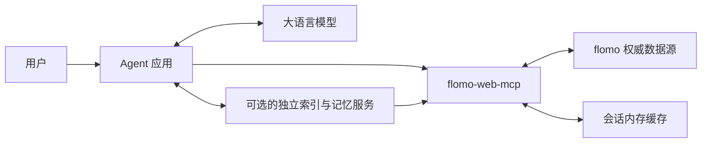

# 提案：面向 Personal Agent 的可靠 flomo 工具层

- 状态：提案，尚未实现；阶段划分为建议，不绑定版本或发布日期。
- 日期：2026-09-29。
- 评估基线：`flomo-web-mcp` 0.2.0，提交 `e692c00`。
- 依据：本次架构讨论及仓库代码检查；未验证 flomo 线上接口的新能力，也未以 Muse 的具体产品能力作为依据。

## 1. 目标与架构边界

将 flomo-web-mcp 定位为稳定、明确、可组合的 flomo 数据访问工具。让上层 Agent 能够完整获取所选范围的数据，执行确定性查询，并判断操作结果、数据覆盖范围和新鲜度。

| 层级 | 职责与状态归属 |
| --- | --- |
| flomo | 持久保存原始笔记，作为权威数据源。 |
| flomo-web-mcp | 认证、请求签名、接口适配、数据解析、基础读写、同步与会话缓存、范围和错误报告。 |
| Agent 应用或独立记忆服务 | 按需持久化副本、建立全文或向量索引、组织上下文、保存回顾状态、调度工作流。 |
| 大语言模型 | 理解意图、选择工具、分析原文、推理关联、生成回答及候选写入内容。 |



“将智能放在上层”包含模型推理和应用工程两部分。索引、调度、状态保存由应用或服务执行，不能仅依靠模型上下文承担。

本提案沿用 [CONTEXT.md](../../CONTEXT.md) 的术语及 [Shared Core 边界](../shared-core-sync.md)：Session Sync Cache 仍然只属于当前进程，不作为备份或持久记忆。查询参数属于数据选择条件；标签排除参数本身不构成访问权限控制。

## 2. 对前几轮建议的重新评估

| 讨论中的建议 | 重新评估后的处理 | 原因 |
| --- | --- | --- |
| 本地持久化缓存 | 移出当前路线；有明确需求时另立提案 | 仓库已明确会话缓存边界，持久化会引入账号隔离、清理、迁移和生命周期管理。 |
| 自动同步后再进行长期记忆查询 | 普通查询保持显式范围和显式同步 | 上层应能决定网络成本与读取范围；现有 `random_note` 的已文档化刷新行为继续单独保留。 |
| 语义搜索、用户画像、回顾推荐 | 放在上层应用或独立服务 | 这些能力依赖模型、业务目标和用户偏好。 |
| 全量分页、标签与时间筛选 | 保留，优先完善分页及其一致性语义 | 是独立于模型的通用数据访问能力。 |
| 增量变更工具 | 降为需要验证的后续方案 | 内部同步可续跑，不等于上游提供长期、完整、可重放的变更日志。 |
| 写入幂等 | 先准确表达结果不确定性 | 本地请求去重无法保证上游只执行一次，尤其在超时和进程重启后。 |
| 结构化输出、只读模式 | 保留为后续独立小改动 | 分别改善接入契约和实际执行约束，不依赖智能能力。 |

优先修复会导致上层作出错误判断的问题，再扩大查询能力。暂不增加编辑、删除、附件上传等写入操作；它们需要独立的使用需求和上游接口验证。

## 3. 当前实现与具体缺口

以下是静态代码检查结果，风险项尚未通过线上实验复现。

| 当前事实 | 影响 | 代码依据 |
| --- | --- | --- |
| `list_notes` 仅接受 `limit`，读取最近批次 | 无法通过列表工具遍历已同步全库；README 的全量范围段落把它包含在可传 `scope` 的工具中，与实现不一致 | [listNotes.ts](../../src/tools/listNotes.ts)、[README.md](../../README.md)、[README.en.md](../../README.en.md) |
| 搜索使用字符串包含匹配，最多返回 100 条，无分页 | 匹配结果较多时，调用方无法继续读取 | [searchNotes.ts](../../src/tools/searchNotes.ts)、[flomoReadClient.ts](../../src/clients/flomoReadClient.ts) |
| 内部已有 `getSyncStatus()`，尚未暴露为工具 | 上层缺少独立、无网络开销的状态查询入口 | [flomoReadClient.ts](../../src/clients/flomoReadClient.ts)、[server.ts](../../src/server.ts) |
| 仅参数相同的进行中同步会合并 | 不同参数的同步可交叠执行，存在缓存提交相互覆盖的风险 | [flomoReadClient.ts](../../src/clients/flomoReadClient.ts) |
| 同步先复制旧缓存，创建成功又可通过 `recordCreated()` 修改缓存 | 同步期间创建的笔记存在被随后同步提交覆盖的风险 | [flomoReadClient.ts](../../src/clients/flomoReadClient.ts) |
| 缺少下一页游标也会进入 `complete: true` 分支 | 非空页解析异常可能被误报为同步完整 | [flomoReadClient.ts](../../src/clients/flomoReadClient.ts) |
| 超时提示统一为“请稍后重试” | 创建操作可能已在上游完成，直接重试可能生成重复笔记；响应解析失败也可能发生在写入之后 | [http.ts](../../src/clients/http.ts)、[flomoWriteClient.ts](../../src/clients/flomoWriteClient.ts) |
| 返回文本块中的 JSON，未声明输出 schema | 程序调用方需要自行解析并验证结构 | [common.ts](../../src/tools/common.ts) |

现有增量同步、删除合并、同步失败时保留旧缓存、原文链接、时间字段以及范围元数据应继续作为基础。现有测试已经覆盖部分同步行为；新增测试应针对上述缺口与新增契约。

## 4. 第一阶段：正确性与完整读取

### 4.1 收紧同步提交与结束条件

建议同一客户端串行执行不同参数的同步，相同请求可合并。同步先构建候选结果，成功后原子提交；失败时保留之前可用的快照。

同步提交还需协调 `recordCreated()`：确保同步期间已确认创建成功的笔记不会被旧快照覆盖。可以通过统一的缓存提交协调和本地写入记录实现，具体方案在实现时选择，不要求锁住所有查询。

结束条件必须区分：正常读到末尾、达到页数上限、游标无进展、响应缺少必要字段。非空页无法生成有效续读游标时应报错；重复或不前进的游标也应终止并报告异常，不能伪装成完成。沿用空页或短页作为末尾的判断时，应记录其依赖的上游分页假设。

验收标准：

- 不同同步参数并发调用时，最终缓存与串行执行的定义一致。
- 同步期间成功创建的笔记在提交后仍可读取。
- 游标缺失、无进展和解析失败不会返回成功完成状态。
- 失败不破坏旧缓存；正常达到 `maxPages` 时仍可继续同步。

### 4.2 为列表和搜索增加分页

扩展 `list_notes` 支持 `scope: "all_synced_notes"`；扩展列表和搜索的分页能力。普通查询不自动建立或刷新全量缓存。无缓存时返回明确的 `NOT_SYNCED`。

建议请求形态如下。本文所有新增字段和错误码均为拟议接口，并非当前可用能力。

```json
{
  "scope": "all_synced_notes",
  "limit": 50,
  "cursor": "opaque-query-cursor"
}
```

响应在现有 `items`、`scope` 之外增加：

```json
{
  "page": {
    "nextCursor": "opaque-next-cursor",
    "hasMore": true
  }
}
```

初版建议使用“缓存版本绑定的游标”，避免长期保存多个完整快照：

- 游标绑定会话、数据版本、工具及筛选和排序参数，查询游标与内部上游同步游标分离。
- 数据版本变化后拒绝旧游标并返回 `CURSOR_EXPIRED`；进程重启后同样失效。
- 同步提交、创建回填及最近批次刷新导致快照替换时，必须正确更新版本。
- 同一版本内排序稳定；排序键相同以 `slug` 作为明确的次级排序键。
- 调用方以相同查询参数续页，仅改变游标；禁止静默忽略参数差异。
- 最近批次分页只遍历该批次，不代表向 flomo 请求更早的笔记。

这提供“版本未变时无重复、无遗漏；版本变化时明确失败”的保证。持续高频修改可能使遍历反复重启；若真实使用出现这一问题，再评估有期限的快照保留机制。

`list_notes` 保持创建时间倒序默认值。`search_notes` 的当前顺序没有明确对外保证，但改变它仍可能影响用户，应在实现前选择并文档化稳定的默认顺序、记录行为变化。

必须分别解释三个概念：

| 字段或状态 | 含义 |
| --- | --- |
| `page.hasMore` | 当前查询、当前数据版本中是否还有下一页。 |
| `scope.complete` | 同步是否按已知上游协议读到末尾；不是本页完整性，也不是强一致性保证。 |
| `scope.syncedAt` | 最近一次同步提交时间；不保证此后上游没有变化。 |

验收标准：静态的完整同步缓存可通过连续调用读完；未完整同步时也可读取已缓存内容，但返回 `complete: false`；筛选结果读完不能改变其来源完整性。覆盖空结果、恰好一页、多页、相同时间值、无效游标和版本变化。

### 4.3 暴露同步状态

新增 `get_sync_status`，返回 `synced`、`totalCached`、`complete`、`syncedAt` 和 `syncing`。不请求 flomo、不返回正文、不触发同步；状态描述最近已提交缓存，正在执行的工作由 `syncing` 单独表示。

验收标准：首次启动、同步中、同步失败、部分完成、全部完成和创建回填后的状态均有明确行为。`ping` 继续只表示 MCP server 可达，不能被文档描述为 flomo 登录态有效。

### 4.4 明确写入结果与重试语义

保留现有错误的 `code`、`message`，按操作补充机器可读信息。建议以 `retryable` 表示“是否适合自动重试当前操作”，以写入错误中的 `outcome: "not_applied" | "unknown"` 表示能否确认未产生远端副作用。

```json
{
  "ok": false,
  "error": {
    "code": "REQUEST_TIMEOUT",
    "message": "请求超时，无法确认笔记是否已创建。",
    "retryable": false,
    "outcome": "unknown"
  }
}
```

- 本地校验失败可确认 `not_applied`；请求可能发出后，超时、连接中断或成功响应无法解析都应保守表达为 `unknown`，除非有可靠证据证明未写入。
- 不依据 HTTP 方法名称判断幂等性；当前创建使用 `PUT`，但每次调用仍会创建新笔记。
- 只读瞬时错误可标记为可重试。上游提供 `Retry-After` 时可解析为 `retryAfterMs`；是否执行重试由调用方决定。
- 保留错误脱敏，不返回原始响应或凭据。
- 未命中继续返回空集合或 `memo: null`，附带实际查询范围；不把部分范围内的未命中表述为全库不存在。

验收标准：创建超时和创建后解析失败均不建议自动重试；读取超时与写入超时语义可区分；现有错误字段继续可用。新增错误码需要在发布说明中提示调用方更新分支处理。

## 5. 第二阶段：确定性查询与接入契约

### 5.1 筛选、排序和输出大小

在第一阶段稳定后，为 `list_notes` 和 `search_notes` 共用一套查询规则：

| 参数 | 建议语义 |
| --- | --- |
| `tags`、`excludeTags` | 标签先归一化，父标签匹配其子标签，排除优先；沿用现有随机选择规则。 |
| `tagMatch: "any" / "all"` | 默认 `any`；`all` 要求每个指定标签都被匹配；空数组不限制。 |
| `createdAfter`、`createdBefore` | 创建时间区间，建议下界包含、上界不包含；名称虽为 After/Before，边界必须在 schema 和文档中明示。 |
| `updatedAfter`、`updatedBefore` | 更新时间区间，同样采用半开区间。 |
| `sortBy`、`order` | 按创建或更新时间升降序，固定次级排序键；不加入主观重要性排序。 |
| `view: "metadata" / "full"` | 默认 `full` 保持当前正文行为；`metadata` 只返回 `slug`、标签、链接及创建和更新时间。 |

时间输入要求带时区的 ISO 8601 时间，内部按时间点比较；无时区输入和无效区间返回参数错误。所有筛选条件组合后再排序、分页。时间无法解释的笔记采用明确规则，例如存在时间过滤时排除并报告计数，不能静默使用本地机器时区补齐。

`updatedAfter` 只是当前可见笔记的筛选，不能返回已删除记录，不得描述成完整增量同步接口。

不截断 `full` 正文而不作说明；初版通过 `limit` 和 `metadata` 控制输出。若以后增加字符上限，必须提供截断标志和获取全文的路径。

验收标准：组合条件、父子标签、时间边界、时区等价时间、稳定排序和投影字段均有行为测试；现有调用不传新参数时保持兼容。

### 5.2 MCP 结构化输出

逐个工具声明 `outputSchema` 并提供 `structuredContent`，保留文本 JSON 兼容现有客户端。两个表示必须来自同一结果对象。明确成功和错误的结构，验证 SDK 对错误结果的处理，避免 schema 校验遮蔽原始错误。

验收标准：代表性客户端和 stdio smoke 检查可以读取结构化结果，原文本调用仍可用；实际输出与 schema 一致。

### 5.3 服务端只读模式

新增可选配置 `FLOMO_READ_ONLY=true`，启用时不注册写入工具，并在写入执行入口校验。默认行为保持兼容。此模式限制当前 MCP 实例，不是 flomo 账号本身的权限变更。

验收标准：只读模式下工具发现不包含 `create_note`，绕过注册层也不能执行写入，所有读取与同步功能仍可用。

## 6. 后续探索：外部服务的增量变更接口

只有在外部索引确有接入需求、并验证上游能力后，才设计 `list_note_changes`。其目标是让调用方维护自己的副本，按页消费 upsert 和 delete，并持有续读游标。

必须先验证：

1. 上游对更新时间相同的多条记录如何排序，游标边界是否包含上一条。
2. 删除标记保留多久，长时间离线后是否还能获取删除信息。
3. 并发修改、分页期间再次更新、长时间暂停和账号变化时的行为。
4. 是否能检测游标过期，如何区分无变更与无法继续。
5. 初次完整读取与后续增量之间如何衔接，避免交接窗口漏数据。

该接口应定义为状态副本同步，不承诺保留每次中间编辑的事件历史。允许重复交付并由调用方按稳定标识合并；不能承诺上游尚未提供的“恰好一次”或永久重放。

如果上游不足以支撑上述契约，使用全量读取与周期性核对恢复副本。核对期间也需考虑上游并发修改，不能把一次遍历视为远端原子快照。

## 7. 交付顺序与验证

建议拆成可独立评审的小改动：

| 顺序 | 交付物 | 依赖与完成条件 |
| --- | --- | --- |
| A | 修正文档中的现有能力描述；同步并发、提交及游标异常处理 | 首先锁定状态正确性；增加对应回归用例。 |
| B | `get_sync_status` 与操作相关的错误语义 | 可独立实现；同步状态建立在 A 的提交模型之上。 |
| C | 全量列表及列表、搜索分页 | 依赖 A 的数据版本管理；能够完整遍历静态缓存。 |
| D | 标签、时间、排序及输出投影 | 复用 C 的游标和查询契约；避免同时扩大参数与分页语义。 |
| E | 结构化输出、只读模式 | 分别独立交付；结构化输出以稳定的响应契约为基础。 |
| 探索 | 外部增量变更接口 | 先提交上游验证结论，再决定是否实施。 |

每个运行时代码改动按 [贡献指南](../../CONTRIBUTING.md) 执行 `npm run verify`，并增加与实际风险对应的测试。第一阶段无需模型评测、向量数据库或 Agent 框架。采用合成笔记与模拟响应验证行为，不把个人笔记或原始线上响应提交到仓库。

共享查询规则、同步行为和错误语义变更按 [Shared Core 同步约定](../shared-core-sync.md) 移植到 CLI，并携带等价行为用例；MCP schema、工具注册等保留在适配层。共享行为版本按现有约定协调，具体发布版本在实现完成后确定。

新增可选参数和字段优先采用兼容方式；错误码细化、搜索排序变化和异常同步行为修正仍需发布说明。新增工具需要同步更新中英文 README、server 注册与 stdio smoke 检查。共享 README 区块如有改动，遵守双仓库同步及指纹检查要求。

## 8. 完成后的端到端能力

上层应用可以查询同步状态、显式同步、分页读取指定范围、按需获取全文，并在自己的服务中建立索引。模型可以基于原文进行分析，由上层决定是否调用 `create_note` 写回；写入不确定时能明确停止自动重试并处理后续核对。

项目的验收重点是数据访问是否完整且可解释、失败是否可正确处理、调用契约是否稳定。笔记的重要性、用户画像、语义关联和回顾策略由上层应用自行演进。
